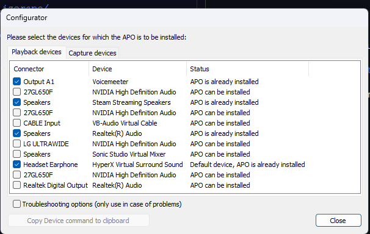
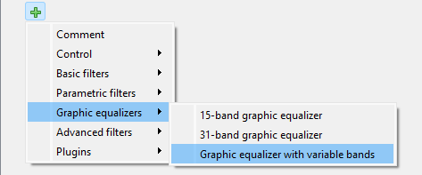

# Equalizer APO presets

## Installion

### Windows
1. Install EqualizerAPO from source forge

> https://sourceforge.net/projects/equalizerapo/

2. Run through the setup in Configuration

3. Select your headphones

4. Run Configuration editor and edit config.txt

5. Select Graphic equalizers > Graphic Equalizer with variable bands

6. Click edit text and copy and paste the file contents to the Graphic EQ

### Linux

1. Install Pipewire

2. Configure Pipewire

